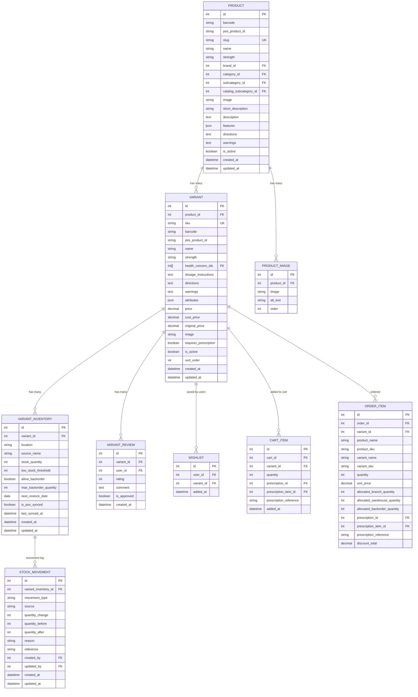
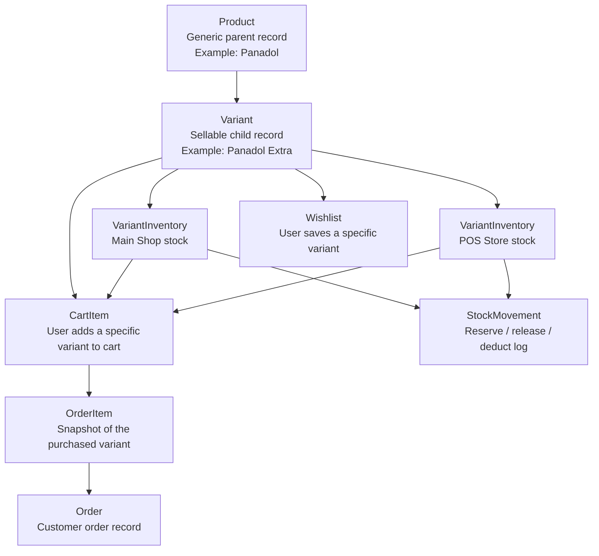

Current design rules:

- `Product` is a catalog parent only.
- `Variant` is the sellable unit.
- Pricing lives on `Variant`.
- Reviews live on `Variant`.
- Wishlist entries point to `Variant`.
- Cart items point to `Variant`.
- Order items point to `Variant`.
- Stock lives on `VariantInventory`.
- Stock movement logs point to `VariantInventory`.

## Workflow Diagram

## Workflow Notes

1. `Product` is created as the generic catalog parent.
2. One or more `Variant` records are created under that product.
3. Each variant gets one or more `VariantInventory` rows by location.
4. The customer interacts with the `Variant`, not the parent product, for wishlist and cart actions.
5. Checkout converts `CartItem` rows into `OrderItem` rows.
6. Inventory changes are recorded against `VariantInventory` and logged in `StockMovement`.
