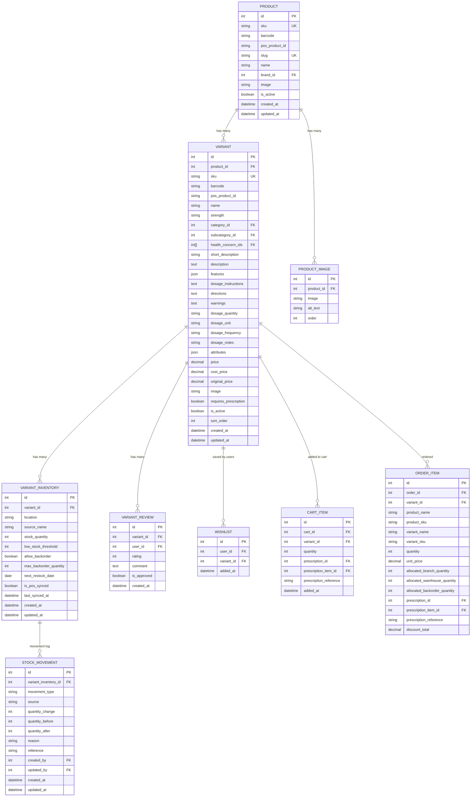
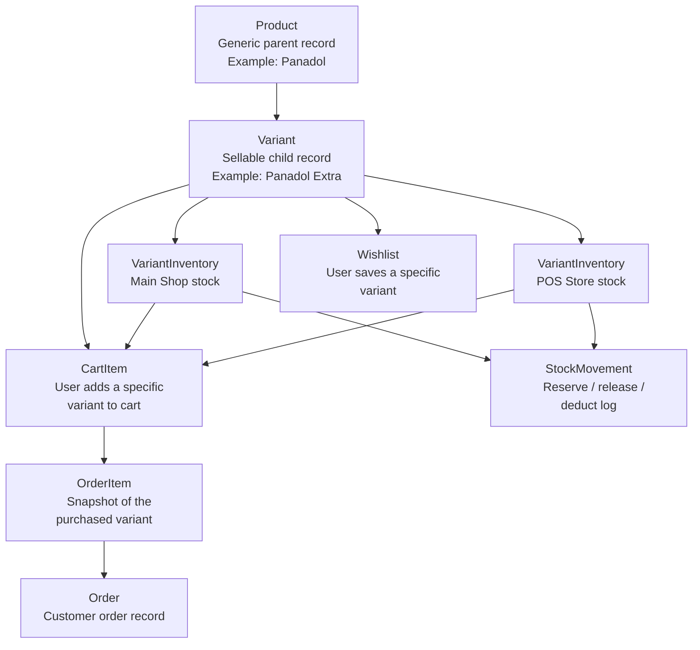

Current design rules:

- `Product` is a catalog parent only.
- `Variant` is the sellable unit.
- Pricing lives on `Variant`.
- Reviews live on `Variant`.
- Wishlist entries point to `Variant`.
- Cart items point to `Variant`.
- Order items point to `Variant`.
- Stock lives on `VariantInventory`.
- Stock movement logs point to `VariantInventory`.

## Workflow Diagram



## Workflow Notes

1. `Product` is created as the generic catalog parent.
2. One or more `Variant` records are created under that product.
3. Each variant gets one or more `VariantInventory` rows by location.
4. The customer interacts with the `Variant`, not the parent product, for wishlist and cart actions.
5. Checkout converts `CartItem` rows into `OrderItem` rows.
6. Inventory changes are recorded against `VariantInventory` and logged in `StockMovement`.

## Category Architecture

Current category-related tables:

- `products_category`
- `products_subcategory`

Current source of truth for live product classification:

- `products_category`
- `products_subcategory`

Why these are the active tables:

- `Variant.category_id` points to `Category`
- `Variant.subcategory_id` points to `products_subcategory`
- public category APIs use `Category`
- admin category APIs under `/admin/categories/` use `Category`
- product filters and serializers use `Category` and `subcategory`

Current practical model:

```text
products_category
  root category

products_subcategory
  child subcategory linked to products_category via category_id

products_productsubcategory
  child subcategory
  optional link back to products_category via category_node_id
```

## Consolidation Recommendation

Target state:

- keep `products_category` only
- represent root categories with `parent_id = NULL`
- represent subcategories with `parent_id = <root category id>`
- remove `products_productcategory` and `products_productsubcategory` after code and data migration

Safe rollout order:

1. Freeze all new writes to `ProductCategory` and `ProductSubcategory`.
2. Update every remaining command, serializer, view, and frontend endpoint name so they explicitly use `Category`.
3. Migrate any remaining legacy rows from `products_productcategory` and `products_productsubcategory` into `products_category`.
4. Remove legacy foreign keys and code paths that still mention `ProductCategory` or `ProductSubcategory`.
5. Drop the legacy tables in a final migration only after checks and data verification pass.

Files that still need cleanup before dropping legacy category tables:

- [models.py](/Users/salmanyagaka/Downloads/ava-pharmacy-web-application-backend-/avapharmacy/apps/products/models.py)
- [serializers.py](/Users/salmanyagaka/Downloads/ava-pharmacy-web-application-backend-/avapharmacy/apps/products/serializers.py)
- [views.py](/Users/salmanyagaka/Downloads/ava-pharmacy-web-application-backend-/avapharmacy/apps/products/views.py)
- [urls.py](/Users/salmanyagaka/Downloads/ava-pharmacy-web-application-backend-/avapharmacy/apps/products/urls.py)
- [seed_catalog.py](/Users/salmanyagaka/Downloads/ava-pharmacy-web-application-backend-/avapharmacy/apps/products/management/commands/seed_catalog.py)
- [rebuild_pharmacy_taxonomy.py](/Users/salmanyagaka/Downloads/ava-pharmacy-web-application-backend-/avapharmacy/apps/products/management/commands/rebuild_pharmacy_taxonomy.py)
