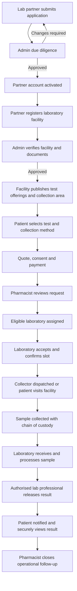

# Ava Pharmacy Laboratory Partner and Patient Collection Workflow Proposal

## 1. Executive summary

Build the laboratory feature as a coordinated healthcare workflow, not as a simple lab-request form. A lab partner first applies and is verified by Ava Pharmacy. After account activation, that partner registers one or more physical laboratory facilities, their licences, service areas, operating hours, tests, prices, turnaround times, collection capabilities, and technicians. Only approved facilities become available for assignment.

A signed-in patient selects tests and requests either an at-home sample collection or a laboratory visit. An Ava pharmacist acts as the operational coordinator: validates the request, confirms any clinical-order requirements, selects an eligible laboratory, agrees the collection slot, monitors hand-offs, and assists the patient. The laboratory remains responsible for specimen processing and clinical release of results. Results are delivered securely to the patient; physical collection can be offered as an optional delivery method.

The implementation should extend the existing Django/React modules, replace frontend-only lab records with API-backed data, and enforce strict object-level access to patient and result data.

## 2. Key product decision

Separate the partner account from the laboratory facility.

- `LabPartner`: the verified legal or commercial account responsible for laboratories.
- `Laboratory`: a physical facility owned or managed by that partner.
- `LabTechnicianProfile`: a professional attached to a specific facility.
- `LabServiceOffering`: a test offered by a facility, including facility-specific price, turnaround time, availability, and collection rules.

The current `LabPartner` record contains both account and facility information. That works for one laboratory per partner but becomes limiting once a partner has several branches, different licences, prices, service areas, and technicians.

### Confirmed fulfillment model

- **Primary service:** a qualified collector visits the patient and collects the specimen at home.
- **Default result delivery:** the patient receives the released result securely through their authenticated Ava Pharmacy account, with a private downloadable document where appropriate.
- **Optional result delivery:** the patient may choose to collect a physical result from the assigned laboratory or designated Ava Pharmacy location when the laboratory supports it.
- Home collection and physical result pickup are separate fulfillment activities and must have separate schedules, assignees, statuses, instructions, and audit events.

## 3. Actors and responsibilities

| Actor | Primary responsibility |
| --- | --- |
| Patient | Chooses tests, provides collection details and consent, pays, tracks progress, and receives results. |
| Ava administrator | Reviews partner and facility applications, verifies documents, activates accounts, manages catalog policy, and handles exceptions. |
| Lab partner | Registers and maintains facilities, offerings, technicians, availability, and operational contacts. |
| Pharmacist coordinator | Reviews incoming requests, communicates with the patient and lab, assigns a facility, confirms scheduling, and manages exceptions. |
| Lab technician/collector | Accepts assigned work, records chain-of-custody events, processes samples, and uploads results for release. |

Pharmacists should coordinate the workflow but should not edit laboratory results. Clinical result creation and release belongs to authorised laboratory personnel. Pharmacist access to result contents should be purpose-based and configurable; operational coordination normally requires status information, not full clinical details.

## 4. End-to-end logical flow

### 4.1 Partner onboarding

1. The partner representative creates an application containing legal identity, ownership/contact details, accreditation, payout details, terms acceptance, and supporting documents.
2. The application moves through `draft -> submitted -> under_review`.
3. The administrator can request corrections without deleting the application.
4. On approval, the application becomes `verified`; Ava provisions a `lab_partner` login and sends an activation link.
5. Suspended or expired partners cannot create facilities, accept work, or receive new assignments.

### 4.2 Laboratory registration

1. The verified partner opens **Laboratories > Add laboratory**.
2. The partner enters the facility name, branch code, physical and geocoded address, county, contacts, operating hours, collection radius, licence/accreditation details, expiry dates, and emergency contacts.
3. Documents are uploaded by type with issue/expiry dates.
4. The facility remains invisible to patients while `draft`, `submitted`, or `under_review`.
5. The administrator approves, requests changes, suspends, or rejects the facility.
6. After approval, the partner configures service offerings and technicians.

### 4.3 Test catalog and service offerings

Keep `LabTest` as the Ava-controlled canonical catalog. A facility links to a test through `LabServiceOffering` and provides:

- facility price and Ava commission;
- expected turnaround time;
- sample type and preparation instructions;
- whether a clinician order is required;
- home collection availability and collection fee;
- service radius/counties and daily capacity;
- active dates and temporary availability.

Patients should only see tests that have at least one approved, active facility offering them.

### 4.4 Patient request

1. The patient signs in and selects one or more tests.
2. The system captures the patient or dependent, contact details, symptoms/notes where appropriate, clinician order if required, preferred date/time, and fulfillment method:
   - home sample collection;
   - patient visit to a laboratory;
   - optional physical result pickup, while secure digital delivery remains the default.
3. For home collection, the patient chooses a saved address and confirms location instructions.
4. The platform displays an itemised quote: tests, collection fee, platform fee, discounts, and total.
5. The patient accepts consent/privacy terms and pays or selects an approved pay-later workflow.
6. A request reference is generated and the assigned pharmacist work queue is notified.

### 4.5 Pharmacist coordination

1. The pharmacist reviews patient completeness, payment, clinician-order requirements, priority, location, and requested time.
2. The matching service ranks eligible facilities by approval status, offered tests, geography, capacity, turnaround time, price, and service quality.
3. The pharmacist assigns a facility or sends the request to several facilities for acceptance, depending on the chosen allocation policy.
4. The laboratory accepts, proposes a new slot, or declines with a reason.
5. The pharmacist confirms the final appointment with the patient and resolves exceptions through a request-specific communication thread.
6. Every assignment, reassignment, schedule change, note, and status transition is audited.

### 4.6 Collection and chain of custody

Use a separate `SampleCollectionJob` rather than overloading `LabRequest`.

1. The lab assigns an active technician/collector.
2. The patient receives the collector name, verified identity indicator, appointment window, and one-time collection code.
3. The collector confirms arrival and validates the one-time code.
4. Each specimen receives a barcode/identifier. Record collection time, specimen type, collector, packaging, temperature requirements where applicable, and patient confirmation.
5. Handover and laboratory receipt are independently timestamped.
6. Rejected, damaged, missing, or insufficient specimens follow explicit exception states and trigger pharmacist/patient notifications.

### 4.7 Processing and results

1. The laboratory marks the sample as received and processing.
2. Authorised lab personnel upload a signed PDF or structured result and record abnormal/critical flags.
3. A second authorised reviewer can be required before release for selected tests.
4. The result changes from `draft` to `released`; only released results are visible to the patient.
5. The patient receives an in-app notification plus configured SMS/email notice without sensitive result details in the message.
6. The patient opens the result through authenticated access and may download it or explicitly share it with a clinician.
7. Critical-result escalation must follow an approved clinical SOP; the software should record acknowledgements without inventing clinical decisions.

### 4.8 Completion, settlement, and support

1. Once the result is released and patient delivery is acknowledged, the request becomes `completed`.
2. Platform commission, laboratory payable amount, collection fee, refunds, and payout eligibility are calculated from immutable transaction records.
3. A dispute or recollection keeps the financial transaction on hold until resolved.
4. Patient feedback is collected separately from clinical results.

## 5. Recommended state models

### Partner application

`draft -> submitted -> under_review -> changes_requested -> verified -> suspended`

### Laboratory facility

`draft -> submitted -> under_review -> changes_requested -> approved -> inactive/suspended`

### Lab request

`draft -> awaiting_payment -> pharmacist_review -> assignment_pending -> lab_assigned -> accepted -> collection_scheduled -> sample_collected -> sample_received -> processing -> result_ready -> completed`

Terminal or exception states: `cancelled`, `expired`, `collection_failed`, `sample_rejected`, `recollection_required`, `refunded`.

Transitions must be validated server-side. Clients should request an action such as `accept`, `schedule_collection`, or `release_result`; they should not be allowed to set arbitrary statuses.

## 6. Proposed backend data model

### Extend existing models

- `LabPartner`: retain legal/account-level data and verification state.
- `LabTest`: retain the canonical Ava test catalog.
- `LabRequest`: add `laboratory`, `assigned_pharmacist`, `requested_by`, `dependent`, `fulfillment_method`, address snapshot, consent timestamps, quoted amounts, currency, payment transaction, and explicit workflow timestamps.
- `LabAuditLog`: replace free-text-only actions with `event_type`, `from_status`, `to_status`, `actor_role`, `reason`, and JSON metadata while retaining a human-readable message.
- `LabResult`: add `status`, `version`, `released_by`, `released_at`, checksum, patient visibility, and superseded-result tracking.

### Add new models

- `Laboratory`
- `LaboratoryDocument`
- `LaboratoryOperatingHour`
- `LabServiceOffering`
- `LabRequestItem` for multi-test requests
- `SampleCollectionJob`
- `Specimen`
- `SpecimenCustodyEvent`
- `LabRequestMessage` or a reusable support thread
- `LabRequestAssignment`
- `LabPaymentAllocation` linking patient payment, Ava revenue, lab payable, and collector fee

Use database constraints to prevent duplicate active offerings, cross-partner technician assignments, multiple active collection jobs for one request, and more than one current released result version.

## 7. API proposal

### Partner and laboratory onboarding

- `POST /api/professionals/register/lab-partner/`
- `GET /api/lab/partner/dashboard/`
- `GET/POST /api/lab/partner/laboratories/`
- `GET/PATCH /api/lab/partner/laboratories/{id}/`
- `POST /api/lab/partner/laboratories/{id}/submit/`
- `GET/POST /api/lab/partner/laboratories/{id}/offerings/`
- `GET/POST /api/lab/partner/laboratories/{id}/technicians/`

### Patient workflow

- `GET /api/lab/catalog/` with location and collection filters
- `POST /api/lab/quotes/`
- `POST /api/lab/requests/`
- `GET /api/lab/requests/` scoped to the patient
- `GET /api/lab/requests/{id}/timeline/`
- `POST /api/lab/requests/{id}/cancel/`
- `GET /api/lab/requests/{id}/result/`
- `POST /api/lab/results/{id}/share/`

### Pharmacist operations

- `GET /api/pharmacist/lab/requests/`
- `POST /api/pharmacist/lab/requests/{id}/assign-laboratory/`
- `POST /api/pharmacist/lab/requests/{id}/confirm-schedule/`
- `POST /api/pharmacist/lab/requests/{id}/reassign/`
- `POST /api/pharmacist/lab/requests/{id}/messages/`

### Laboratory operations

- `GET /api/lab/work-queue/` scoped to the laboratory
- `POST /api/lab/requests/{id}/accept/`
- `POST /api/lab/requests/{id}/decline/`
- `POST /api/lab/requests/{id}/assign-technician/`
- `POST /api/lab/requests/{id}/collection-events/`
- `POST /api/lab/requests/{id}/specimens/receive/`
- `POST /api/lab/requests/{id}/results/`
- `POST /api/lab/results/{id}/release/`

All mutation endpoints should use idempotency keys where retries could duplicate payments, assignments, collection events, or result releases.

## 8. Frontend modules

### Patient

- Lab catalog and test details
- Multi-step request/quote/consent/payment flow
- Collection scheduler and address selection
- Request timeline with clear next action
- Secure result viewer and sharing controls

### Lab partner

- Onboarding/application status
- Laboratory facility management
- Documents and licence-expiry dashboard
- Offerings, prices, schedules, and service areas
- Technician and collector management
- Assigned request work queue and payout summary

### Pharmacist

- Dedicated lab coordination queue
- Filters for unassigned, awaiting lab acceptance, collection exceptions, overdue processing, and result ready
- Facility matching and reassignment controls
- Patient/lab communication thread
- SLA and escalation indicators

### Administrator

- Partner and facility verification
- Document review and expiry management
- Test catalog policy
- Full request timeline, dispute handling, and audit export
- Operational and financial reporting

The existing frontend `LabRequestManagement` currently uses local-storage data. It should be replaced with the backend API before the new workflow is enabled; otherwise admin, patient, partner, and technician screens will show different records.

## 9. Security and privacy requirements

- Apply object-level permissions on every request, specimen, message, and result endpoint.
- Patients can access only their own requests/results or dependents they are authorised to manage.
- Lab partners can access only facilities they own and work assigned to those facilities.
- Lab technicians can access only work assigned to their facility and, where appropriate, to themselves.
- Pharmacists can access only requests assigned to their coordination queue; clinical-result access should be separately authorised and audited.
- Administrators retain audited support access.
- Use private file storage with short-lived signed downloads; never expose permanent public result URLs.
- Scan uploads, validate file signatures rather than trusting extensions/MIME headers, encrypt data in transit and at rest, and log every result view/download/share.
- Avoid patient details in SMS/email content.
- Define retention, deletion, correction, breach-response, and consent policies with Kenyan healthcare/privacy counsel before production launch.

Immediate remediation is required in the current implementation: authenticated users must not be able to retrieve arbitrary `LabResult` records by ID, and laboratory technicians must not receive all requests across all partners.

## 10. Reliability, audit, and operations

- Use transactional service functions for state transitions and payments.
- Use asynchronous jobs for notifications, document scanning, reminders, and payout calculations.
- Add SLA timestamps and scheduled escalation jobs.
- Record structured audit events for every state transition and sensitive-data access.
- Add monitoring for assignment delays, failed notifications, overdue collections, overdue results, rejected samples, and payout discrepancies.
- Make notification delivery retryable and observable; do not silently swallow failures.

## 11. Implementation phases

### Phase 0 — Decisions and SOP alignment

Confirm pharmacist access boundaries, payment timing, assignment policy, critical-result procedure, and cancellation/refund rules. The fulfillment terminology is confirmed: home sample collection is primary, secure digital result delivery is the default, and physical result pickup is optional.

### Phase 1 — Security and source-of-truth correction

Add object-level authorization, scope technician queries, secure result downloads, remove the local-storage admin workflow, and write regression tests.

### Phase 2 — Partner/facility onboarding

Introduce `Laboratory`, facility documents, approval workflow, licence expiry handling, offerings, and partner facility screens.

### Phase 3 — Patient request and pharmacist coordination

Build catalog filtering, quote, consent, payment link, pharmacist queue, facility matching, assignment, and scheduling.

### Phase 4 — Collection and laboratory processing

Add collection jobs, technician assignment, specimen barcodes, custody events, processing states, exceptions, and SLA notifications.

### Phase 5 — Results, settlement, and reporting

Add result review/release, secure delivery, sharing, payout allocations, disputes, reports, and audit export.

### Phase 6 — Hardening and rollout

Complete end-to-end tests, role/permission tests, upload security tests, performance testing, accessibility review, pilot deployment, monitoring, and operational training.

Indicative effort for a production-grade first release is approximately 10–14 engineering weeks for a small team, depending on payment, messaging, mapping, and external laboratory-system integrations. A narrower pilot with manual facility matching and no LIS integration can ship earlier.

## 12. Acceptance criteria

- A partner cannot register a facility until the partner is verified.
- A facility cannot receive requests until it is approved and has an active offering.
- A patient receives an immutable quote before payment and request submission.
- A pharmacist can assign and coordinate a request without editing clinical results.
- A partner or technician cannot see another facility’s patient work.
- Every specimen handoff and status transition is timestamped and attributable.
- Only released results are visible to the owning patient.
- Result files are private, access-controlled, and audited.
- Payment, refund, commission, and payout totals reconcile to the request.
- Admin, patient, pharmacist, partner, and technician interfaces all use the same backend records.

## 13. Decisions required before coding

1. Does Ava assign one pharmacist per request, per branch, or through a shared queue?
2. Does the patient pay before assignment, after lab acceptance, or via a refundable authorisation?
3. Can one request contain several tests and can those tests be split across facilities?
4. Who is permitted to collect samples: lab technicians only, certified phlebotomists, or approved logistics personnel?
5. Should pharmacists see full result content or only operational status unless the patient consents?
6. Is facility selection automatic, pharmacist-controlled, patient-controlled, or hybrid?
7. Which notification channels and response-time SLAs are required?
8. Is integration with a laboratory information system required for the first release?
9. What cancellation, recollection, refund, and payout rules will operations use?
